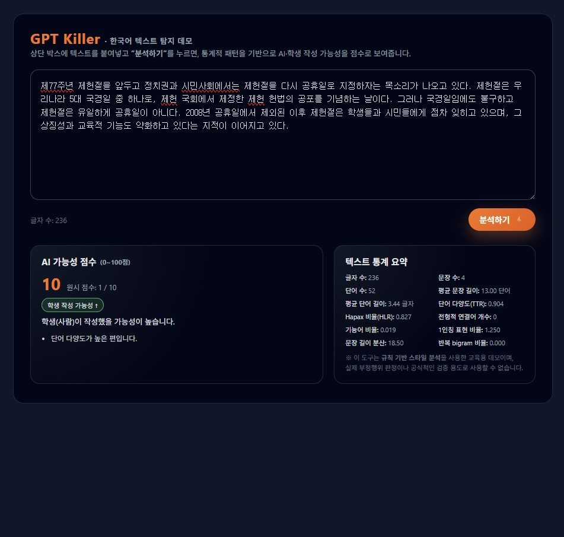
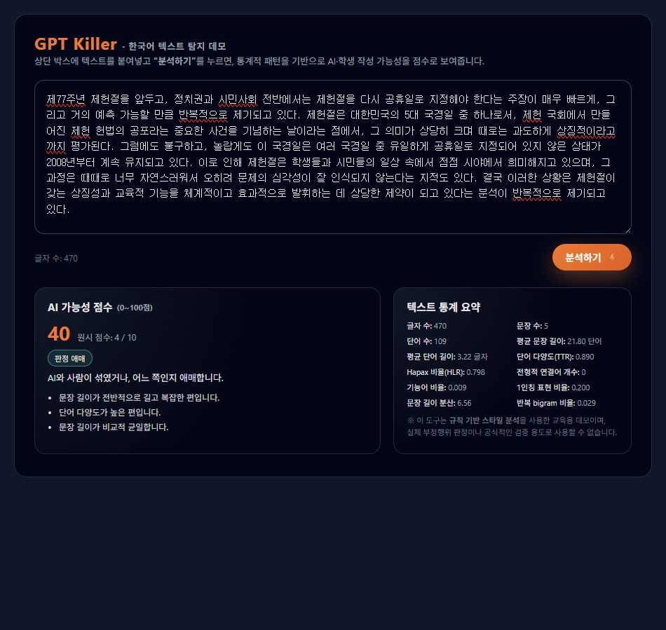

# 🎯 GPT Killer (한국어 텍스트 AI 탐지기)

**GPT Killer**는 사용자가 입력한 텍스트가  
**AI(예: ChatGPT)가 작성했을 가능성**이 높은지, **사람이 작성했을 가능성**이 높은지를  
언어적 특징 분석을 통해 점수화하는 *교육용 데모 프로젝트*입니다.

이 도구는 웹 기반 UI(gpt_killer_imple.html)와 Python 분석 엔진(gpt_killer.py)로 구성되어 있으며,  
텍스트의 여러 통계적·언어적 패턴을 분석하여 **0~100점 AI 점수**와 함께 근거를 제공합니다.

---

## 🔍 프로젝트 개요

AI 생성 텍스트가 증가하면서 AI가 작성한 텍스트와 사람이 작성한 텍스트의 구분이 어려워졌습니다. 
GPT Killer는 다음과 같은 언어적 특징을 활용하여 텍스트 패턴을 분석합니다:

- 평균 문장 길이 및 단어 길이
- 단어 다양도(Type-Token Ratio, TTR)
- Hapax Legomenon 비율(한 번만 등장하는 단어 비율)
- 전형적 AI 연결어/클리셰 빈도
- 기능어 비율
- 1인칭 표현 비율
- 문장 길이 분산
- 반복 bigram(두 단어 조합) 비율

이러한 특징들은 AI 모델이 자주 반복하는 문체 특성을 반영하며,  
이를 통해 텍스트가 사람/AI 중 어느 쪽에 더 가까운지를 추정합니다.

---

## 🌐 웹 UI 실행 방법

1. `index.html` 파일을 더블클릭하여 실행  
2. 브라우저(Chrome, Edge 등)에서 GPT Killer 화면이 열림  
3. 상단 텍스트 박스에 문장을 입력  
4. **"분석하기" 버튼 클릭**
5. 아래 카드에서 다음을 확인:
   - AI 점수(0~100)
   - 원시 점수(0~10)
   - 학생/AI 가능성 판정
   - 탐지 근거(Reason)
   - 텍스트 통계 데이터

웹 UI는 HTML + CSS + JavaScript로 구성되어 있으며 브라우저만 있으면 별도의 서버 없이 단독 실행이 가능합니다.

---

## ⚙️ 분석 알고리즘
GPT Killer는 총 10개의 언어적 특징을 기반으로 **0~10점(raw_score)**을 계산한 뒤,
[AI 점수 = raw_score x 10]으로 환산해 **0~100점 스케일**로 표현합니다.

### 주요 평가 항목

| 항목 | AI 특징 사례 | 점수 |
|------|--------------|------|
| 평균 문장 길이 ≥ 18 단어 | 과하게 정돈된 문장 구조 | +2 |
| 단어 다양도(TTR) ≥ 0.45 | 불필요하게 높은 어휘 다양성 | +1 |
| Hapax Rate ≤ 0.30 | 단어 반복 경향 | +1 |
| 전형적 AI 연결어 ≥ 5회 | “전반적으로, 결론적으로, 종합하면…” | +2 |
| 기능어 비율 ≥ 0.30 | 지나치게 매끈한 문장 연결 | +1 |
| 1인칭 표현 거의 없음 | 인간적 경험이 드러나지 않음 | +1 |
| 반복 bigram 비율 ≥ 0.2 | 어구 반복 패턴 | +1 |
| 문장 길이 분산 ≤ 15 | 문장 구조가 균일함 | +1 |

### 최종 판단 기준

- **70~100점:** AI가 작성했을 가능성이 높음  
- **40~69점:** 애매(사람+AI 혼합 또는 판단 불가)  
- **0~39점:** 학생(사람)이 작성했을 가능성이 높음  

---

## 💡 GPT Killer 실행 데모 화면
## 사람 텍스트 데모 이미지

## AI 텍스트 데모 이미지

---

## 📚 참고자료

본 프로젝트는 아래 자료들을 참고하여 규칙 기반 탐지 로직을 설계했습니다.

- tbhb, **"vale-ai-tells"**, GitHub, 2025
https://github.com/tbhb/vale-ai-tells
- Chidimma Opara, **"StyloAI: Distinguishing AI-Generated Content"**, 2024
- Kaplan et al., **"The Statistical Characteristics of AI-Generated Text"**, 2023
- 국립국어원 기능어/접속사 자료

> 해당 자료들은 모두 오픈소스로 공개되어 있으며,  
> 본 프로젝트는 이를 참고자료로만 활용했습니다.

---

## 📄 License

본 프로젝트는 **MIT License**를 따릅니다.  
자유롭게 수정·사용 가능하나, 출처 표기를 유지해야 합니다.

---

본 GPT Killer는 AI 탐지 기술을 이해하기 위한 **교육용 규칙 기반 모델**입니다.  
실제 GPT Detector와 동일한 수준의 정확성을 추구하는 것이 아닌,  
텍스트 패턴을 분석해 **AI스러운 특징이 무엇인지 학습하는 목적**으로 설계되었습니다.
